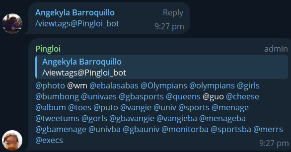
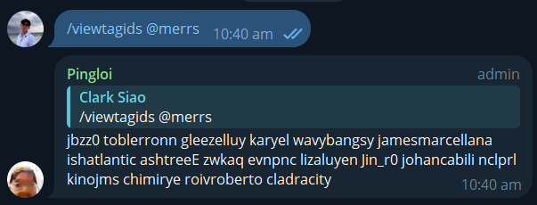
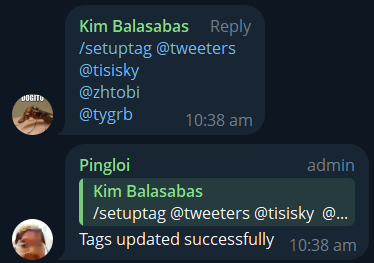
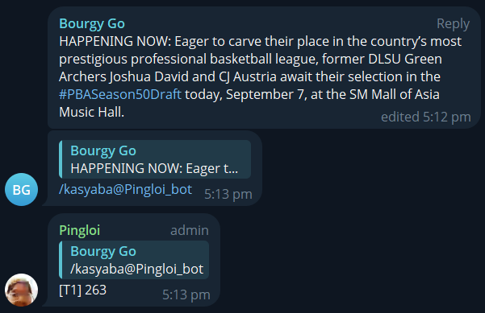
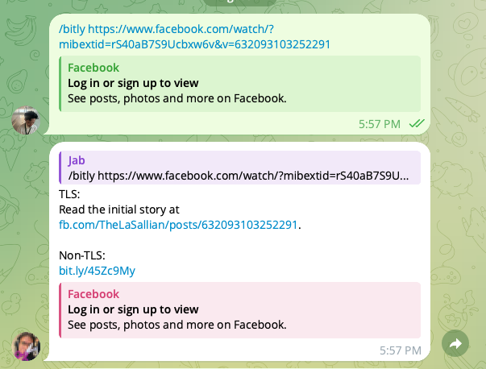
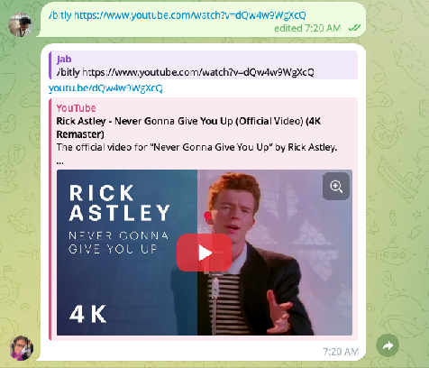
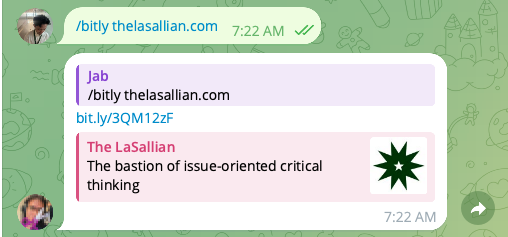

## 5.1. Pingloi

Pingloi is a Telegram bot created in Web 62 and developed by Gleezell Uy to replace existing third-party Telegram bots and solve the issue of server downtimes. It acts as a tool to tag and ping a collective of staffers based on a list of defined tags while abstracting their usernames. The bot is currently hosted 24/7 under [Fly.io](http://Fly.io), shared-cpu-1x 256mb VMs with 3GB persistent volume storage and 160 GB outbound data transfer under Singapore region on a free legacy plan.

During server maintenance, the same code may be hosted under pythonanywhere.com, which will run the bot for 24 hours max without resetting. The bot is also dependent on MongoDB and the Telegram API server. For reference, future updates will be based on my public repository Telegram-Ping-Bot-Prototype.

| /viewtags   | Gives you all the tags in that specific group chat. |
| :---- | :---- |
| /viewtagids @[tag]
 | Gives the usernames of the people in a specific tag. |
| /setuptag @[tag]  @[username1] @[username 2]  | Sets up the people included in a specific tag. Perform this again without the username in order to delete the tag. |
| /kasyaba  | Reply to a body of text to know if it is within the 280-character limit of X. If the number is a negative value, it means you have exceeded the limit. |
| /authenticate [password] | Validates your use of Pingloi. |

Setting up Pingloi  
1. Make sure you are an admin of the chat and can add new admins.  
2. Add pingloi and set her as admin.  
3. Authenticate using the password, once Pingloi says password accepted, delete password (make sure it’s in Spoiler and delete it for everyone immediately).  
4. Setup tags and you're free use Pingloi after that.

## 5.2. Bitray

Bitray is a bot created in Web 64 by Jabin Guamos to allow Web staffers to create shortened links via Bitly through Telegram. It relies on the free tier, and gets around the 10 (at the time of writing) free shortens per month per account by having API keys from multiple users. It was developed to be deployed through Cloudflare Workers.

The bot can only be used in chats that are authorized, where authorization is done through the command **/authorize**. But that command is only accepted if the user’s username is stored as an env variable in the deployed program.

Once the chat is authorized, users are able to use the bot through **/bitly {some_url}**. All links passed through this command will return a shortened link from bitly except for YT links (where it uses YT’s own system e.g [youtu.be/dQw4w9WgXcQ](http://youtu.be/dQw4w9WgXcQ)). For Facebook links, the bot does additional processing to find the post’s ID. Only when found will the bot also return a permalink where it assumes the post is from TLS (always appends the ID to a TheLaSallian link). What’s interesting is that, though TheLaSallian is written as the poster, posts from other users will still work albeit without a preview card.

| Type of link | Output |
| :---- | :---- |
| Facebook Post |  |
| Youtube video |  |
| Other |  |

A common problem you might find is the bot being unresponsive. It’s possible that the bot isn’t receiving your messages. If that is the case, either tag the bot in your commands (/bitly@BotName) or make the bot an admin. This is needed as bots by default can’t read text messages they aren’t tagged in.
