**The LaSallian** has several types of coverages. These include the single Happening Now (HN) tweet, single Happening Now Instagram Story (HN IGS), Livetweet, Live Instagram Stories (IGS), and Recap Articles. Each of these is described in the subsections below.

### 8.2.1. Happening Now (HN)

An HN coverage is the simplest among all coverages. Since it does not require constant attention from a Web staffer, an HN coverage is usually not assigned to anyone specifically. Rather, it is sent to the Newsroom or a specific group chat tailored to the event if the coverage involves multiple HNs. However, sports HN coverages are treated differently. They are assigned to a specific staffer beforehand, and the “SPORTS” kicker is used in the caption. The same staffer will also be in charge of the drafting the caption for the recap article counterpart.

The photos below are example tweets of an HN coverage.

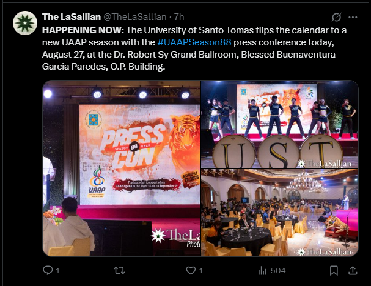  
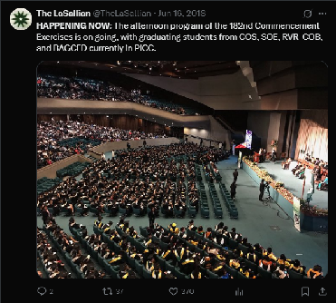

Most HN coverages are posted on three platforms only: X, Telegram (TG), and Facebook (FB). However, it is crucial to clarify first with the Photo Editor or the Assistant Editors if the coverage has an album deliverable. If yes, keep the post to the three platforms mentioned only. Otherwise, post the HN to Instagram (IG) as well. 

The visuals used in an HN coverage usually come from the Photo section, and rarely from the Intermedia section. Before posting, ensure that the following points are followed:

* either the drafted tweet has already been proofed by the Executive Editors, Web has already been given the *go* signal by the writing section editor, or the 5-minute rule has already taken place (make sure to still clarify with the writing section editor if this rule will be followed)  
* the visuals have already been watermarked by the section editor or assistant editors  
* the drafted tweet has been double-checked by the Web staffer (you), in terms of **The LaSallian**’s [points of style](https://drive.google.com/file/d/1HSTcwYTTxNwJCXRowIdw141PIlLNS9q0/view?usp=sharing).

### 8.2.2. Happening Now Instagram Story (HN IGS)

The visual needed in an HN IGS is a deliverable primarily taken care of by the Web section. This means an in-person appearance of the assigned Web staffer at the designated venue is expected. However, since this is only an HN IGS, the Web staffer is often allowed to leave the premises as soon as the Web Editor has approved the deliverable, unless the coverage needs supervision from the staffer for possible events that may occur, unprecedented or not.

The following snaps below are examples of an HN IGS deliverable. More examples are available on our Instagram account’s Archive.

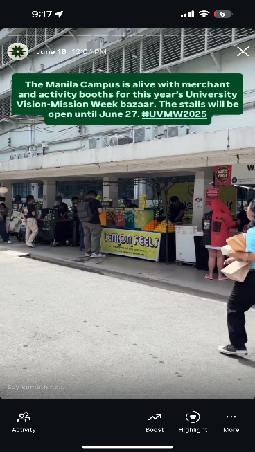  
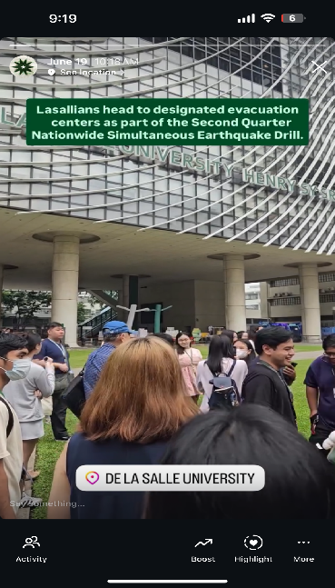

An HN IGS coverage is often planned beforehand for an event that was either requested by a writing section editor or approved by the managing editor for an external organization’s coverage request. However, there are also times when an HN IGS coverage is spontaneous, which requires voluntary participation from web staffers within the vicinity of the event, such as earthquakes, campus flooding, and other unprecedented events within and beyond the University. 

As a general rule of thumb in capturing an HN IGS, panning the camera from left to right (or vice versa) is usually advised for still subjects. An example of this is a seated audience listening to a speaker on stage. Meanwhile, a still video shot is recommended for a moving subject, such as students walking in line or people moving to protest.

### 8.2.3. Livetweet

A livetweet coverage is one of the most intensive types of coverage handled by Web. This type of coverage requires speed and precision, since the content entailed in a livetweet are real-time updates of an event. As a student publication, **The LaSallian** needs to publish these updates as soon as possible without risking the accuracy of information. Furthermore, a livetweet coverage can last for hours, depending on the length of the event. At certain times, shifting hours for two or more staffers can be established to share the burden of work.

**Deliverable Structure**  
The structure of a livetweet usually begins with a “HAPPENING NOW” kicker on the main tweet, while the subsequent tweets are posted as replies to it. 

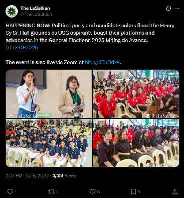

On other platforms, the link to the main tweet posted on X is included in the caption to redirect the viewers to the livetweet coverage, since the subsequent real-time updates are only posted on X. As a style guide, the sentence “Follow The LaSallian’s live coverage at [link].” is written at the bottom of the tweet.  Ensure that the copied link from X is clean, with the “[https://www](https://www).” and the final “/” trimmed from the link, and a period is written after the link since it is a complete sentence. The snaps below are examples of the main tweet posted on the TG and FB platforms.

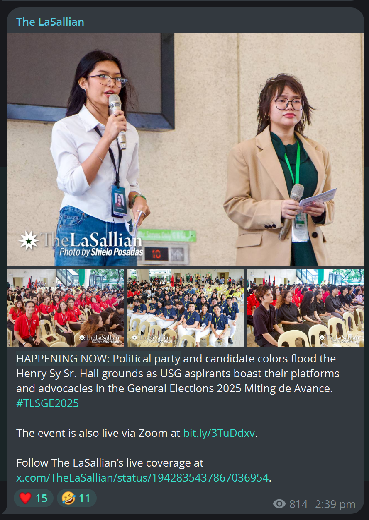  
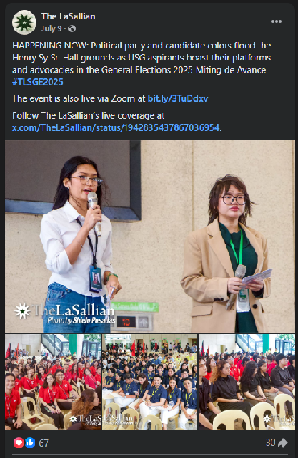

**Types of Livetweet Coverages**  
Visual-wise, there are two types of livetweet coverages, regardless of the writing section involved: the visual livetweet and the textual livetweet.

In a visual live tweet, the series of tweets posted after the main tweet contains visuals sent by the Photo or Intermedia section. While a visual livetweet’s goal is to have each subsequent update be posted with a media file, there are also times when a subsequent update misses a visual due to unfortunate circumstances, such as late deliverables due to poor internet connection. Common examples of this type of coverage include the annual Animusika concert, the Animo Christmas event, and rally coverages. Example tweets are shown below.

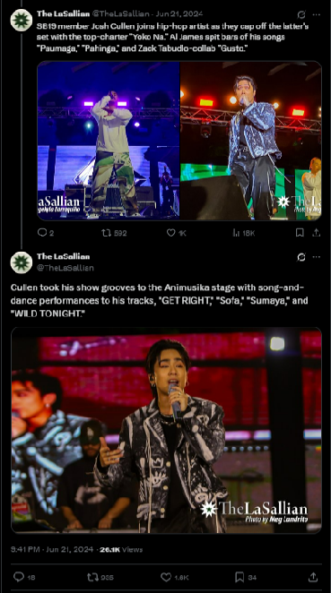  
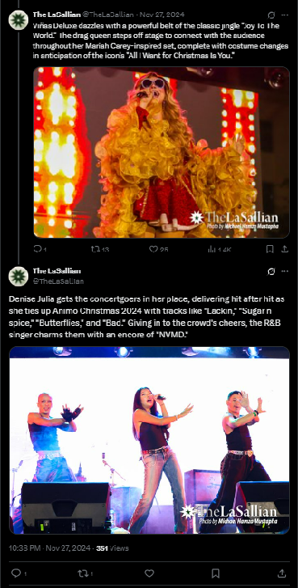

On the other hand, a textual livetweet coverage type is more straightforward—only the main tweet contains a visual, while the rest of the subsequent tweets only contain text. 

This type frequently occurs on sports livetweet coverages, including basketball, volleyball, and football. Among these three, only the football coverage has a specific halftime tweet that requires a visual from Photo.

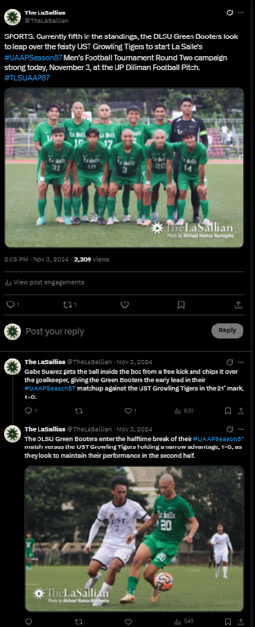

In addition, across these three sports, a “Buzzer” tweet is posted as a quote retweet to the main tweet with a visual from the Layout section. The “Buzzer” is the **most important** deliverable in a sports-related livetweet, since its goal is to signal the endof the match by giving out the results, which is highly anticipated by our audience. Hence, ensure that it is your utmost priority when posting under pressure. 

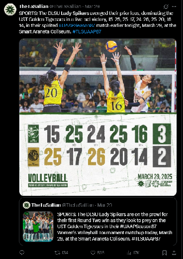

Textual livetweet coverages are usually facilitated in Google Sheets for a more organized process. Remember to wait for the “G?” column to be ticked by the assigned Executive Editor before posting, and tick the “Posted?” column after posting the tweet.  
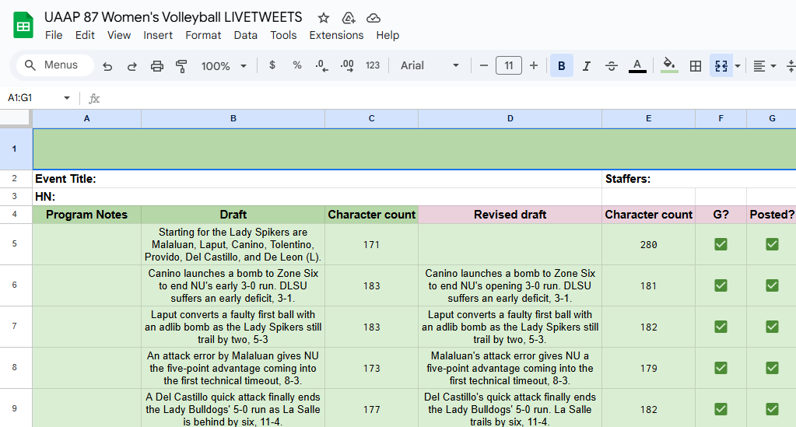

The screenshot below shows an example of the subsequent tweets posted in a textual livetweet coverage. More information about the specifics of sports coverages can be found in the UAAP Sports Manual in Section 8.6.

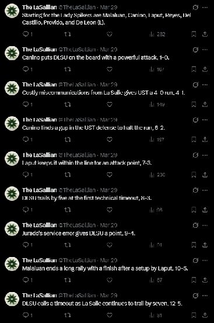

**Coverage Pace**  
Livetweet coverages are usually fast-paced because the updates we provide reflect the quick succession of events in real-time. Examples of fast-paced livetweet coverage include:

* UAAP Volleyball   
* UAAP Basketball  
* University Elections Miting de Avance  
* National Elections  
* Large-scale rallies

However, there are also livetweet coverages that are slow-paced, either due to the slow turn of events in real-time or the writing section editor opted for fewer deliverables. Examples of slow-paced livetweet coverages include:

* UAAP Football  
* Animusika  
* University Elections Debate  
* Animo Christmas  
* Pasinaya (art festival)  
* Small-scale rallies

Nonetheless, a Web staffer assigned to a livetweet coverage must be vigilant and prepared to deliver the content to our social media platforms as quickly as possible, regardless of the pacing. This is because a delay in delivery can be costly, not just in the level of reach and amount of interactions we can achieve, but also in our audience’s trust in our publication to keep them updated.

### 8.2.4. Live Instagram Stories (IGS)

Arguably, the Live Instagram Stories (IGS) coverage is the most tedious among all coverages for a Web staffer due to the physical presence requirement, the length of stay involved, and the need to capture the needed deliverables at the most accurate time. An IGS coverage is usually partnered with a livetweet coverage handled by another Web staffer. However, there are also times when an IGS coverage is a standalone, which means both captions and visuals are handled by the Web section.

The deliverables for an IGS coverage differ from one event to another. The following sections divide the IGS coverage protocols, depending on the presence of a livetweet coverage.

**IGS Coverage with a Partnered Livetweet Coverage**

***Main Story***  
The first Instagram story is designated as the main story with the following content:

* Caption  
  * This is taken from the drafted tweet of the writing section, with the kicker “HAPPENING NOW.” To make it an IGS caption, remove the kicker and the indicated location in the tweet.  
* Location Sticker  
  * Copy the location from the drafted main tweet of the livetweet coverage and convert it into an Instagram location sticker. If there is none, consult your Web Editor or Assistant Editors.  
* Link  
  * Copy the link to the main post of the livetweet coverage from X and paste it as a link sticker with “FOLLOW THE LASALLIAN’S LIVE COVERAGE” as the placeholder text.

In the screenshots below, take note of the color and background color of the caption, the style selected for the link and location stickers, and their placements in the story with respect to the margins on all sides. Please also take note of the difference in captions between the main story of the IGS coverage and the main tweet of the livetweet coverage. In posting a story, remember that when in doubt, consult your Web Editor or Assistant Editors.

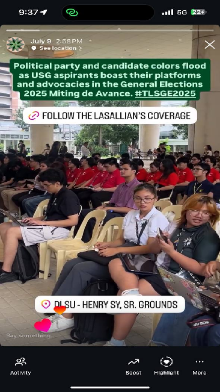  
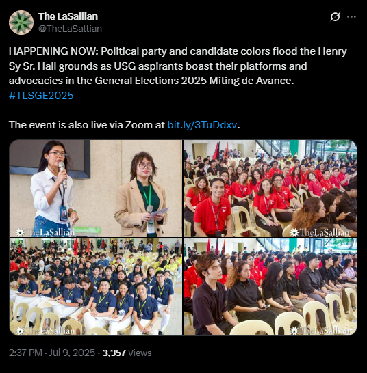

***Succeeding Stories***  
In the succeeding stories of the IGS coverage, only include the caption in the story. This caption is also taken from the succeeding tweets of the livetweet coverage. See the images below for reference.

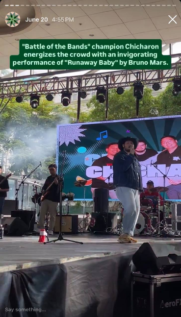  
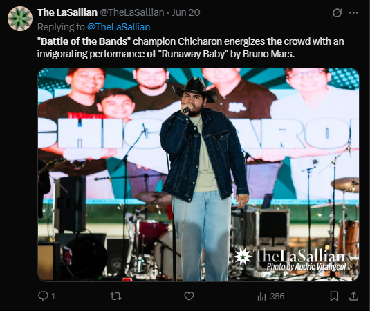

***Buzzer (Final Story)***  
For non-sports coverages, please ignore this deliverable. However, for a sports IGS coverage, the final story is always the buzzer, which indicates the result of the match. The content posted in this story includes both the caption and the location sticker. Take the caption from the drafted buzzer of the Sports section, which will be sent in the Telegram group chat assigned for the sport. See the images below for reference.

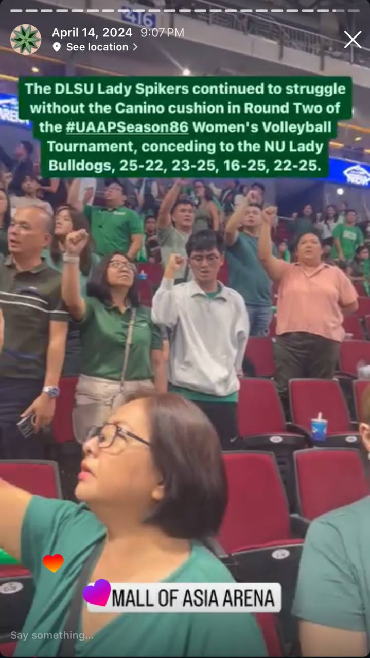  
**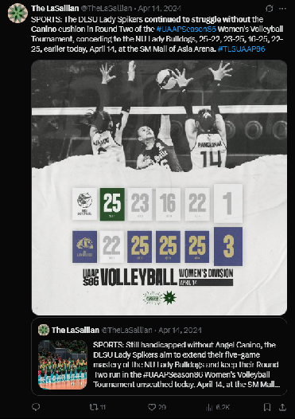**

**IGS Coverage with No Partnered Livetweet Coverage**  
An IGS coverage with no partnered livetweet coverage usually just contains an HN coverage as its counterpart. Hence, only the caption for the main story would come from the writing section, while the succeeding stories would come from the Web Editor or Assistant Editors. 

***Main Story***  
The first Instagram story is designated as the main story with the following content:

* Caption  
  * This is taken from the drafted tweet of the writing section for the HN coverage. To make it an IGS caption, remove the kicker and the indicated location in the tweet.  
* Location Sticker  
  * Copy the location from the drafted main tweet of the livetweet coverage and convert it into an Instagram location sticker. If there is none, consult your Web Editor or Assistant Editors.

In the screenshots below, take note of the color and background of the caption, the styles selected for the location sticker, and their placements in the story with respect to the margins on all sides. Please also take note of the difference in captions between the main story of the IGS coverage and the tweet of the HN coverage. In posting a story, remember that when in doubt, always consult your Web Editor or Assistant Editors.

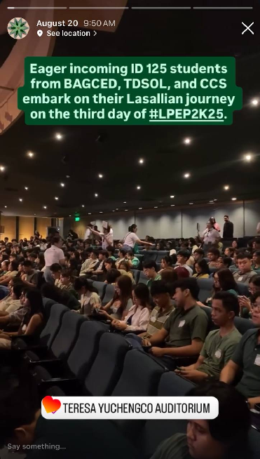  
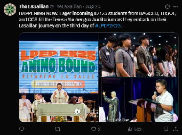

***Succeeding Stories***  
In the succeeding stories of an IGS coverage without a livetweet coverage counterpart, the captions that you need to include in the stories would be drafted by either the Web Editor or the Web Assistant Editors. For this reason, wait for the captions in the same Telegram group chat where the visual deliverables are sent. See the photo below for your reference.

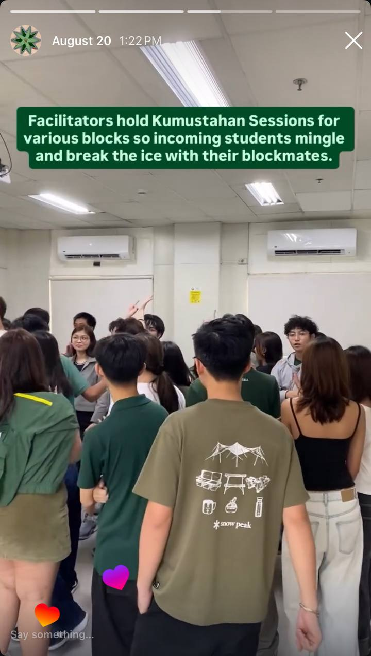

**Coverage Reminders**  
Before engaging in your assigned IGS coverage, please remember the following preliminary requirements:

1. For sports-related coverages and other coverages that require passes, ensure that you have obtained your ticket from the Managing Editor or Web Editor.  
2. For camera settings, ensure that you have the HDR setting off since this can cause the exported video to be too bright. If you have an iOS device, set the default video settings to 1080p 60 fps. Otherwise, use the highest quality settings.  
3. Ensure that you have sufficient mobile data since sending videos over Telegram and posting them on Instagram can be data-consuming. If your designated venue is the Smart Araneta Coliseum, a Smart SIM card is usually the best option.  
4. Ensure that you have enough battery. Bring a power bank as a backup measure.  
5. For sports-related coverages, wear only neutral-colored (e.g., black or white) tops since we must maintain our non-bias stance in sports events. This means supporting the Green-and-White while covering is strictly forbidden. For University election-related coverages, such as the Debate and Miting de Avance, ensure that you wear colors that are not part of the restricted campaign colors, which shall be announced by the University Editor. On other coverages not mentioned, you are free to wear whatever you like.

**Process**

1. Anticipate the deliverable since in an actual setting, the events can happen too quickly, and not anticipating them can result to missed deliverables.  
2. Capture the deliverable with your device. Take many shots if possible.  
3. Send your best captured video to the designated Telegram group chat. The UAAP IGS group chat is usually separated from the rest of the IGS coverages.   
4. Wait for approval of the sent visual from the Web Editor. Recapture the event when asked, specifically when particular instructions about the shot were given to you.  
5. Send your candidate videos as file once approved to the designated IGS channel or group chat. To send videos as a file on Telegram, select the “File” tab when choosing an attachment, not the “Gallery tab,” then select “Select from Gallery.”   
6. For newbies, your task ends with capturing and sending the visual. For regulars, post the deliverable on Instagram together with the needed content (caption, location sticker, or link). Ensure that when you post on Instagram, it is automatically shared to Facebook.

**Deliverables**  
The deliverables needed for sports coverages are usually constant. To view the list of deliverables per sport (basketball and volleyball), please consult the UAAP Sports Manual in Section 8.6.

For non-sports coverages, the deliverables always vary depending on the event. Await instructions from the Web Editor or clarify with him/her about it before heading to the venue.

**Tips**

1. For sports IGS coverages, the general rule of thumb is to follow where the ball is headed, like an actual audience watching the match.  
2. For non-sports IGS coverages, the general rule of thumb is to pan the camera from left to right (or vice versa) for still subjects. An example of this is a seated audience listening to a speaker on stage. Meanwhile, a still video shot is recommended for a moving subject, such as students walking in line or protesters moving in a rally.  
3. While focus on the subject is important, it is also crucial to leave space in the vertical video for the caption and the location sticker. Hence, zoom in or zoom out to perfect the angle of your camera. Consult your Web Editor or Assistant Editor if necessary.  
4. On fast-paced coverages like basketball and volleyball matches, keeping track of the deliverables while sending the files and posting them on Instagram can be confusing and tedious under pressure. If not handled well, the consequences are often missed shots on some of the deliverables. As a tip, favorite or bookmark the approved visuals on your gallery, so as not to lose sight of them when you finally have the time to post.   
5. In terms of priority, always capture the needed deliverables first before posting, since missing the specific shots would no longer have second chances.

### 8.2.5. Recap Article

**Sports Recap**  
Recap articles are common for sports coverages. While some sports entail per-match recaps, other sports have tournament-wide recaps instead due to the risk of redundancy across the articles. As a Web staffer, our role in this type of coverage is to draft a caption for the recap article and upload the article to **The LaSallian**’s official website. To learn more about uploading articles, please consult Section 3.1.1. In terms of captions, remember the following process:

1. Draft caption within X’s character limit of 280 characters, including the article link, the “SPORTS:” kicker, and the two hashtags (#UAAPSeasonXX and #TLSUAAPXX, where XX represents the current season number).  
2. Send your drafted caption to the Telegram group chat of the respective sport and tag your Web Editor and Assistant Editors for editing.  
3. Wait for the proofed caption.  
4. While waiting for the proofed caption, you may upload the article to the TLS website. Ensure that the article has already been proofed by the Executive Editors and that the article visuals have already been sent by the Photo section.  
5. Post the article to X and FB only.  
6. Upload the recap as an Instagram story (for volleyball and basketball matches only). This is usually handled by the Web Editor or the Assistant Editors. However, if assigned to you, consult them about the format since it can change per season.

In drafting your caption for a sports recap, please take note of the following tips and reminders:

* Search for previous examples in **The LaSallian**’s official X page by looking up the previous TLS UAAP hashtags (i.e., #TLSUAAPXX) to help you in drafting the captions.  
* Highlight specific plays or players in the match that resulted in the win or loss to pique the interest of our audience.  
* Never create your own wordplays of the terms and names associated with UAAP teams or the tournaments in general.  
* Avoid having the same angle as the HN or Buzzer tweets since this can promote unnecessary redundancy, leading to lower engagements.  
* Include possible trivia in your caption (e.g., the [highest number of blocks recorded in the tournament in a single match](https://x.com/TheLaSallian/status/1917563311538987475)) that can entice our audience into reading the article.

The screenshot below is an example recap article posted on X as a tweet and on Instagram as a story.

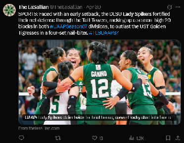  
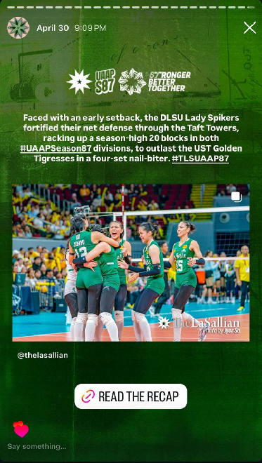

**Non-Sports Recap**  
For recap articles that are not sports-related, these are usually found in Notion under the “Online” category. Topics related to these usually include recently-concluded events, University admin discussions, organizational competitions, and the like. This type of article does not occur often, unlike sports recap articles. Like the sports recap, Web is also assigned to draft a caption for non-sports recap articles. The process of doing this task is the same as the Sports coverage, except Notion is used as the primary platform. See the image below as a reference for a non-sports recap article.

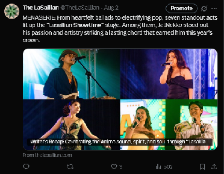
