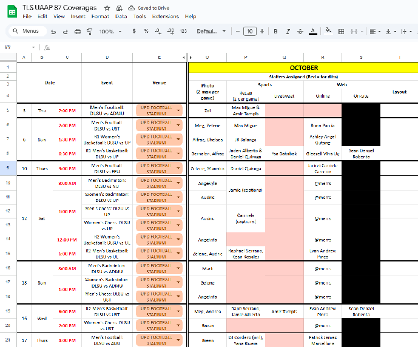
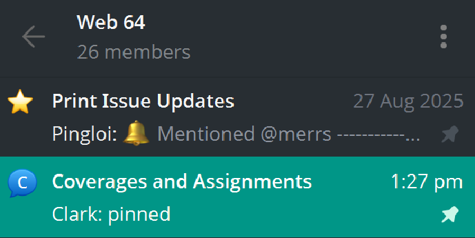
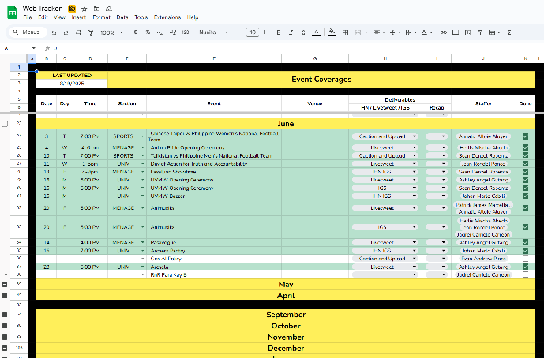

Volunteering for coverages can be done in multiple ways. For UAAP sports-related coverages, an enlistment system is usually done on Google Sheets on the official TLS UAAP Coverages masterlist. The Web Editor will announce when Web staffers can enlist in their desired sports and deliverables to cover for the month. Watch out for the Web Editor’s announcements because specific sports coverages can fill out fast.

The second method is through the Coverages and Assignments topic of the Web Telegram group chat. The coverages here are usually those not yet assigned to any staffer, even after the enlistment period, or those that are urgent. Just reply with “10-61” to the coverage that you intend to take.

The final method is through the Web Tracker Google Sheets. The coverages entailed in this file are usually the non-UAAP sports coverages and the coverages endorsed by the other writing sections.

