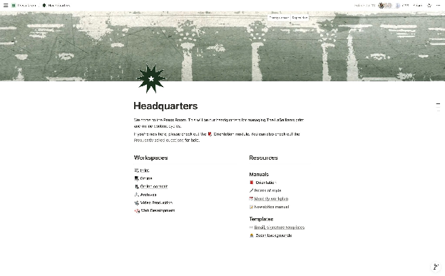
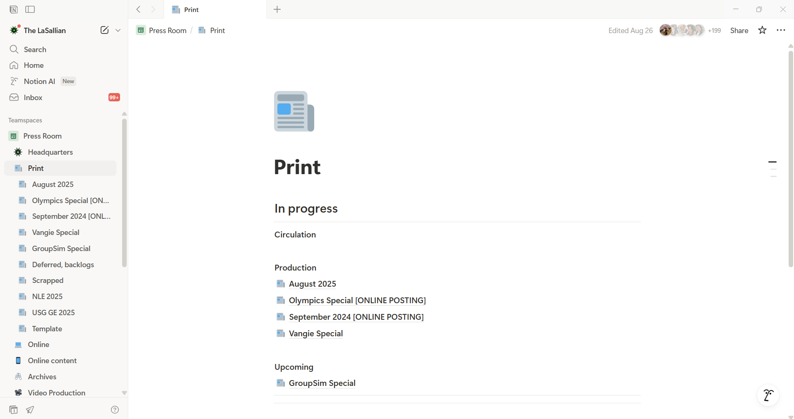
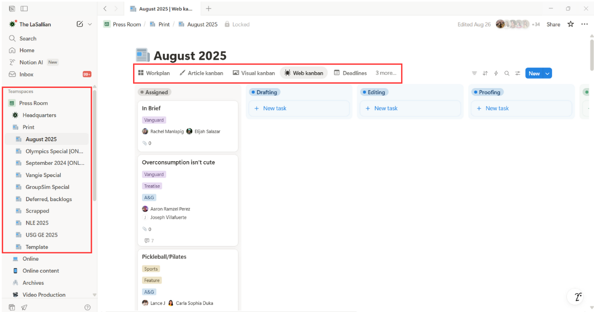
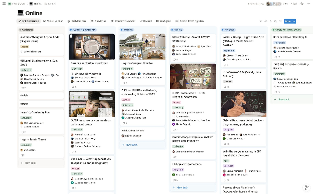
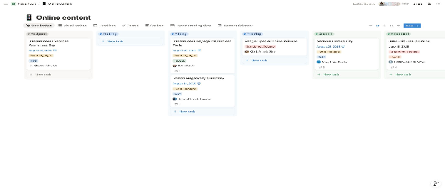
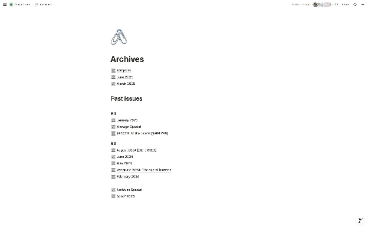
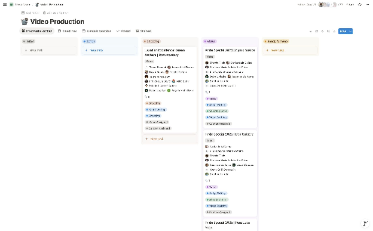
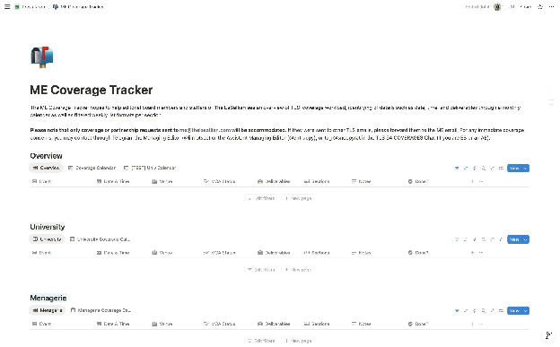
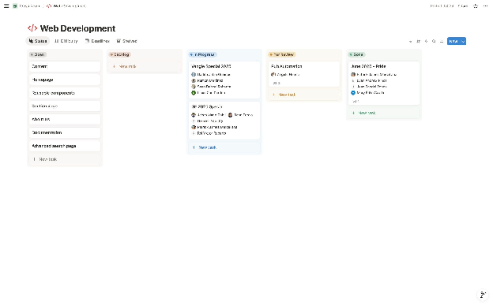

Notion is **The LaSallian**’s content tracking platform for all print and online deliverables across all sections of the publication. The organization migrated to Notion in May 2024, following Trello’s updates to its free tier, which restricted the number of users in a Trello workspace. It is recommended that you explore these boards and have a good grasp of using Notion as it is the main workspace of TLS.

## 9.1. Workflow

The workflow will vary depending on the content or task being tracked using Notion. This part will discuss the workflows for articles, online content, and systems development.

### 9.1.1. Article Workflow

The workflow in the Print and Online boards (See 6.2.2. Print and 6.2.3. Online) will follow the development of the article.

* Writers will primarily be responsible for creating and moving the cards.  
* Tech staffers are included to monitor the development of the article and easily coordinate with the assigned staffers. They will still follow their section's respective process of approval.

**Instructions**

1. After writers have received their assignments (and assigned a person for tech to contact), they shall **make a card** in the respective workspace. They shall be in charge of editing all the tags and attaching the necessary files and Google folders in their respective properties.  
2. **As Web staffers,** you are expected to update the **Web status** accordingly.  
3. Once the article is in the proofing stage or done, Web staffers can draft captions. When posted, they are to link the article in the comments.  
4. The article/content status can be marked as **Done** once all deliverables have been accomplished.

### 9.2.1. Systems Workflow

The workflow for article and online content cards will follow the development of the article and visuals, as applicable.

## 9.2. Boards

Boards are the pages found  in our Notion workspace. Each board serves its own purpose.

### 9.2.1. Headquarters

  
The Headquarters can be considered as the homepage of our workspace. It is recommended that staffers who do not know how to use Notion, head to the Orientation module tab first before anything else. The Workspaces contain the shortcut to the subpages of our workspace. The resources is where other manuals can be found as well as templates like the email signatures and Zoom backgrounds can be used for official correspondence.

### 9.2.2. Print

Print is divided into months or issues. It contains all the articles for the specific cycle. In the Print page you can see which issue/s are in circulation, production, and upcoming.

  
Once you select the issues, you will be presented with different views, each tailored to a specific section’s staff member for them to track progress on their own section’s deliverables. It’s important to always update your deliverables. The panel on the left serves as a shortcut to other print issues. Print articles require two captions for X and one caption for FB.

### 9.2.3. Online

The Online board is dedicated to online articles, except for Sports coverages, not found in Print. Similar with the Print board, there are also different views catered to each section’s needs. Online articles require only one caption for FB and one caption for X.

### 9.2.4. Online Content

The Online Content board is where all social media content is assigned and  tracked. This includes deliverables such as  Event Highlights, Instagram stories, Article Slides, Instagram article stories, Poptown, and From the Archives. This is not to be confused with the Online board, which tracks the development of online-only articles.

### 9.2.5. Archives

The Archives Board contain all of the previous issues. This is used for archiving and documentation purposes only, Web staffers can look at these issues for reference in making their captions.

### 9.2.6. Video Production

The Video Production board is where the Intermedia section plot their projects and tracks their progress. When the project is done it will be labelled as Ready for Web. Videos are posted on FB, IG, and X.  

### 9.2.7. ME Coverage Tracker

This board is mainly handled by the ME. It contains most, if not all, coverages that TLS has accepted.

### 9.2.8. Web Development

The Web Development board is where we keep track, document, or store ongoing or completed projects. It’s divided into different phases and are also labeled according to their priority.  

