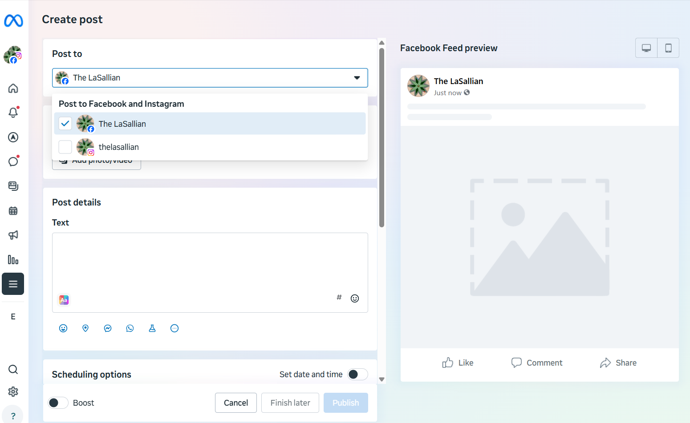

The main purpose of social media posting is to promote **The LaSallian**’s articles, expand readership, and disseminate the information they contain. As social media remains the main channel through which audiences engage with our content, posts must be managed with accuracy and consistency. Responsibility for ensuring proper standards in posting lies with the Web section and the Editorial Board. 

Social media posting is also applied in other contexts within the Web section; these will be discussed separately under the [*Coverages*](../coverages/) section of this manual.

The LaSallian manages four primary platforms—Facebook, Instagram, X, and Telegram. The succeeding section specifies which members of the organization are authorized to handle these accounts, as well as the type of content designated for each platform.

| Breakdown of social media platforms |  |  |  |  |
| ----- | :---- | :---- | :---- | :---- |
| Platform | **Facebook** | **Instagram** | **X** | **Telegram** |
| **Account details**	 | The LaSallian | @thelasallian | @thelasallian | @thelasallian |
| **Who has Access** | Execs  All Writing Editors Web Editor Asst. Web Editor Photo Editor Asst. Photo Editor Regular Web Staffers | Execs  Web Editor Asst. Web Editor Photo Editor Asst. Photo Editor Regular Web Staffers | Execs  All Writing Editors Web Editor Asst. Web Editor Photo Editor Asst. Photo Editor Regular Web Staffers All Web Newbies  | Execs  All Writing Editors Web Editor Asst. Web Editor Regular Web Staffers Selected Web Newbies |
| **Ideal caption length**  | Maximum of three paragraphs | Maximum of two paragraphs  | Maximum 280 characters. | Maximum of three paragraphs  |
| **Edit option**  | ✓ - Caption 
✓-  Image  | ✓ - Caption 
✓ - Can only remove the image, but can’t add to it | ✗- Caption ✗- Image  | ✓ - Caption 
✓ - Image |

| Content per Platform |  |  |  |  |
| ----- | :---- | :---- | :---- | :---- |
| **Platform**  | **FB** | **IG** | **X** | **TG** |
| **Newsbite**  | **✓** | **✓- Only if the HN does not have an album** | **✓** | **✓** |
| **Event art**  | **✓** | **✓** |  |  |
| **Online article ** | **✓** |  | **✓** |  |
| **Slide- quote** |  | **✓** |  |  |
| **Game day pub** | **✓** |  | **✓** | **✓** |
| **Game day story** | **✓** | **✓** |  |  |
| **Live tweet updates**  | **✓- HN only**  |  | **✓- HN and thread updates**  | **✓- HN  only** |
| **Editorials** | **✓** | **✓** | **✓** | **✓** |

| Retain kicker |  |  |  |  |
| ----- | :---- | :---- | :---- | :---- |
| **Platform**  | **FB** | **IG** | **X** | **TG** |
| **NOTICE** | **✓** |  | **✓** | **✓** |
| **PRESS RELEASE** | **✓** | **Not posted**  | **✓** | **Not posted** |
| **Newsbites** | **✓** | **Posted here if there is no album.** | **✓** | **✓** |
| **HNs/Livetweets** | **✓** |  | **✓** | **✓** |
| **Other articles** |  | **Not posted except for IG slides** | **✓** | **✓** |
| **WATCH** | **✓** |  | **✓** | **Not posted** |
| **FROM THE ARCHIVES** | **✓** |  | **✓** | **Not posted** |

## 4.1. Facebook

Facebook is **The LaSallian**’s second most-followed platform, and it is mainly used to share our articles and keep our readers updated on the latest announcements. To manage posts on Facebook, we make use of two tools: Facebook’s built-in **Publishing Tools** and the newer **Meta Business Suite,** which will be discussed in more detail in the next subsection. The latter also allows scheduling for both Facebook and Instagram, making content management more convenient. 

For **Publishing tools**, below are the steps for posting:

1. Go to Publishing Tools > Create.   
2. Paste the proofed caption and the article link in the box that will pop up.  
3. Click the preview button to make sure that the link is working.  
4. Remove the article link, but not the preview, from the post.  
5. Schedule or post depending on the assigned date and time found in the Notion or from the instructions of the Web Editor/ Asst. Web Editor.

For the **Meta Businesses Suite,** below are the steps for scheduling:

1. Go to Meta Business Suite >Create Posts.  
2. Click the + button on the lower right section of the website and click add post.  
3. Paste the proofed caption and article link.  
4. Wait for the card to fetch the preview for the post.  
5. Remove the article link if a preview appears; **if no preview appears, make sure that you have debugged the link before pasting it to the post.**  
6. Schedule or post depending on the assigned date and time found in the Notion or from the instructions of the Web Editor/ Asst. Web Editor.

### 4.1.1. Debugger

The Facebook Sharing Debugger is a tool that allows users to check and update how a link appears when shared on Facebook. Since we regularly post articles on social media, this is useful for ensuring that our articles display the correct title, description, and thumbnail image.

**Steps to use the tool:**

1. Copy the article link – Select the URL of the article from The LaSallian’s website.  
2. Go to the [Debugger](https://developers.facebook.com/tools/debug/.)   
3. Paste the link – Enter the article URL in the search box provided.  
4. Click “Debug” – The tool will generate a preview of how the link will appear when shared on Facebook.  
5. Review the preview – Check if the title, description, and thumbnail are correct.  
6. Click “Scrape Again” if needed – If the preview still shows old or incorrect details (e.g., outdated headline or missing image), use the *Scrape Again* button to refresh Facebook’s cache of the link.  
7. Make corrections if errors appear – If the Debugger flags a missing thumbnail image, edit the article and attach the image again; if that’s not the case, coordinate with the Web editor/ Asst. Web editor before posting.

## 4.2. Instagram

Instagram is **The LaSallian**’s youngest platform, and it primarily serves as the platform for event artworks, game day pubs for sports content, slide-quotes for online articles, Instagram stories for live coverages, and recap photos from different activities. To schedule posts, the Web team uses Meta Business Suite, which also makes it easier to manage content for both Instagram and Facebook.

To post using Business Suite:

1. Meta Business Suite > Create Post > Instagram Feed  
2. Paste the proofed caption and remove the kicker.   
3. Click **Add Content** and upload the designated photo/video. *Gifs must be converted to video.*   
4. Schedule or post depending on the assigned date and time found in the Notion or from the instructions of the Web Editor/ Asst. Web Editor

## 4.3. Meta Business Suite

Meta Business Suite is the main platform used to manage The LaSallian’s content for both Facebook and Instagram. It plays an important role in our workflow, as it is the only tool that allows scheduling of Instagram Stories and provides the post IDs needed for updating newsbites. The platform also offers a Planner tab, where all scheduled and published content can be viewed in one place, making it easier to monitor activity and ensure consistency across both channels.

To post for both Facebook and Instagram: 

1. Meta Business Suite > Create Post > Choose Facebook and/or Instagram.  
2. Paste the proofed caption. Do not forget to remove the kicker for Instagram. Only ERRATUM will be retained for Instagram posts.  
3. Click **Add Content** and upload the designated photo/video.   
4. Schedule or post depending on the assigned date and time found in the Notion or from the instructions of the Web Editor/ Asst. Web Editor

## 4.4. X, Formerly Twitter

X is The LaSallian’s most followed platform, with around 216k followers. It serves as an avenue for article postings, live tweet updates, and news bites. This is the first social media access given to the Web newbies. 

Tweets are also organized according to Kickers for easier categorization. Within The LaSallian, tweets generally fall under three types: online-only posting, regular posting, and coverage—the last of which will be discussed in more detail in the [Coverage](../coverages/) section of this manual.

X has a lot of limitations, so keep a few things in mind when posting or scheduling. Always remember the 280-character limit and if uploading long videos, use mobile to bypass the video length resctriction. 

| Online-only | This [example](https://x.com/TheLaSallian/status/1944385020249993572)  follows the format of: [KICKER] [CAPTION] [*HASHTAG if needed*] [LINK]. This type of posting is reserved for articles that were written online, and not meant for the physical issue. Coverage, event recaps, and UAAP/FilOil game recaps are examples of these posts.  Example: Note that the link is turned into a preview |
| :---- | :---- |
| Regular article posting | This type of posting is divided into three tweets.  The [first twee](https://x.com/TheLaSallian/status/1587331100594110465)t follows the format: **[KICKER][TITLE][ | via [LINK]] [PHOTO]**  The [second](https://x.com/TheLaSallian/status/1587361301667487746) and [third](https://x.com/TheLaSallian/status/1587380174139674625) tweet follows the format: **[KICKER][CAPTION][LINK]** When a photo is attached, the photo will have priority. This means that the link will not be turned into a preview, and the photo will be the one showcased. **The photo must have the watermark.** Example: Note that the link is turned into a preview if no photo is attached. |

### 4.4.1. X Card Validator

It is a tool provided by X Developers to help preview and verify that your web links are correctly formatted for Twitter Cards (also now simply “X Cards”). These cards include metadata such as title, description, and image, enhancing how your content appears when shared on X.

How to use the tool:

1. Copy the article link – Select the URL of the article from The LaSallian’s website.  
2. Go to the [X Card Validator](https://cards-dev.x.com/validator)   
3. Run the URL through the validator  
4. Click “Preview Card”  
5. You’ll see a message indicating success or detailing any errors.  
6. If issues are flagged, adjust your HTML accordingly and revalidate the link. If unfamiliar, coordinate with the Web editor/ Asst. Web editor regarding this matter. 

## 4.5. Telegram

**The LaSallian** uses Telegram as a supplementary news distribution platform, primarily aimed at readers who prefer real-time notifications and a clutter-free feed. Unlike other social media platforms where posts compete with algorithms and entertainment content, Telegram provides a direct and distraction-free channel for disseminating stories, breaking news, and urgent announcements.

Content shared on Telegram includes links to published articles, timely updates on campus-wide events, and essential advisories that Lasallians need immediate access to. Each post is formatted for clarity and brevity, often accompanied by the article headline, a concise summary, and a direct link to the full story. This ensures that readers can quickly decide whether to read more while staying informed at a glance.

To post in Telegram: 

1. Copy the proofed caption and save the watermark version of the image   
2. Open the Channel and attach the proofed caption and media via the clip icon  
* Be careful not to post the file version of the image because the file name would appear in the message   
3. Click the arrow icon to post  
4. To edit posted images,  
* Open the telegram app on desktop, click the photo you want to change, click edit, select the switch icon on the left side and replace the image. 

For scheduling: hold the send button → Schedule Message.
