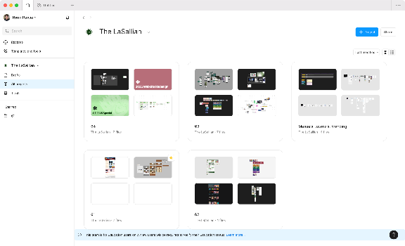
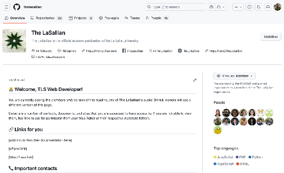
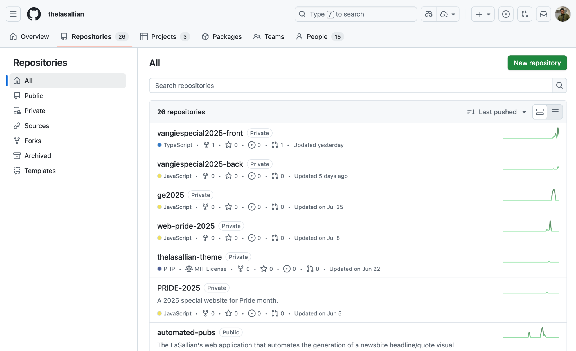

### 10.6.1. Figma

Figma is our primary tool for collaborative design. All wireframes, mockups, and prototypes for web specials, microsites, and other projects are created here. An exception is when low-fidelity wireframes are created on paper or on an external whiteboard application.

We have a Figma Education team, **The LaSallian,** where the Web Editor, Assistant Web Editors, and all web development staffers are members. If you are part of a project team and do not have access, ask the Web Editor to be added. Inside the team, our projects are organized by publication year (e.g., 64, 63, 62, and so on.) Typically, a single design file within a project will contain multiple pages for all the web specials and microsites developed during that year. We also have a separate project for “Manuals, tutorials, branding,” which contain Figma’s default onboarding files as well as a “Utility Library” file with reusable components for labelling design frames, which help keep our design files organized and easy to understand

### 10.6.2. GitHub

GitHub is where we host our code repositories for version control and collaboration. Our organization is located at [github.com/thelasallian](http://github.com/thelasallian). All web specials, microsites, and other development projects have their own repository. As of writing this manual, we do not have strict coding and naming conventions. Ideally, all repositories must have a `README.md` file. All web development staffers are members of the GitHub organization. If you are part of a project team and do not have access, ask the Web Editor to be added.

