### 3.1.1. Uploading Articles in WordPress

This section covers the general steps for creating a new post and uploading an article to the TLS website ([thelasallian.com](http://thelasallian.com)). For detailed rules on formatting, images, and other article data, you must consult sections [3.1.2](.#312-general-formatting-rules-and-reminders) to [3.1.4](.#314-headnotes-and-endnotes) after completing these steps to maintain consistency across all published articles. Alternatively, you may watch this [video](https://drive.google.com/file/d/1IJ7GoXAAb7lsMhjn8YrkMpjLULMH0ERX/view?usp=sharing).

1. **Access the author’s article document.** Open the Google Docs version from Notion. Identify the article's title, byline, and body—these are the elements you will copy in the next steps. Do not include the author's personal notes or outline.  
   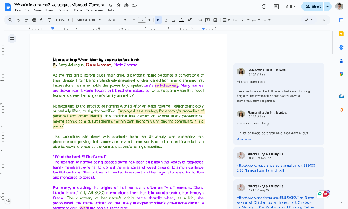  
     
2. **Log in to the WordPress admin dashboard**. Access [thelasallian.com/wp-admin](http://thelasallian.com/wp-admin), log in with your credentials, and complete the two-factor authentication. Credentials are provided by your Web Editor. Upon successful login, you will be redirected to the Dashboard.  
   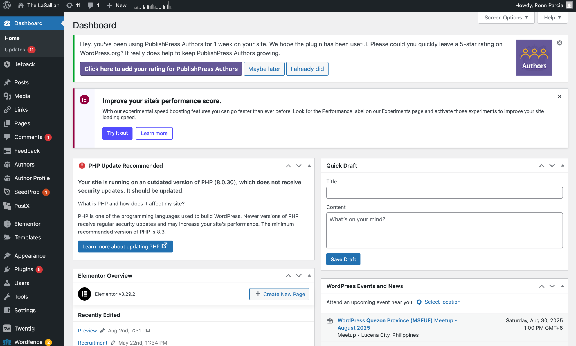  
     
3. **Create a new post.** On the left sidebar, navigate to **Posts > Add New.**  
   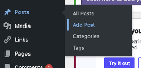  
     
4. **Add the article title and body.** In the title field, paste the text without formatting (**Cmd-Shift-V** for macOS or **Ctrl-Shift-V** for Windows) to avoid unwanted HTML characters like &nbsp;. Use the **H2** block for all article subheadings.  
   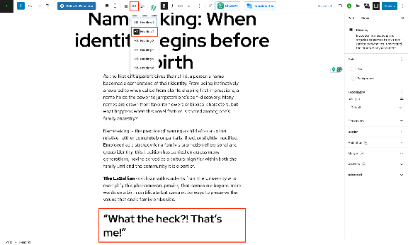  
     
5. **Add the article visuals.** Upload the compressed, non-watermarked JPG visual as the **featured image** and the compressed, watermarked version as an **inline image**. Center-align the inline image and place it either before the first subheading or near the most relevant paragraph. See section [3.1.2](.#312-general-formatting-rules-and-reminders) for complete requirements.  
   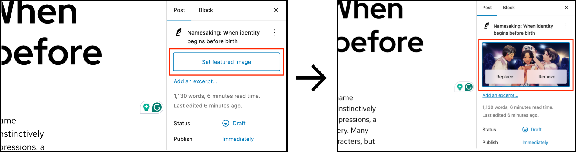  
     
   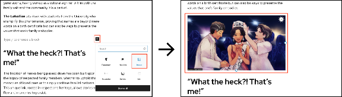

6. **Add the remaining article data.** In the right sidebar, assign the excerpt, category, tag, and author(s). Additionally, add the image caption, if applicable. Assign the category based on the writing section and the tag specified on the Notion card; add authors in the order they appear in Google Docs (see [3.1.2](.#312-general-formatting-rules-and-reminders) for complete requirements and special cases).  
   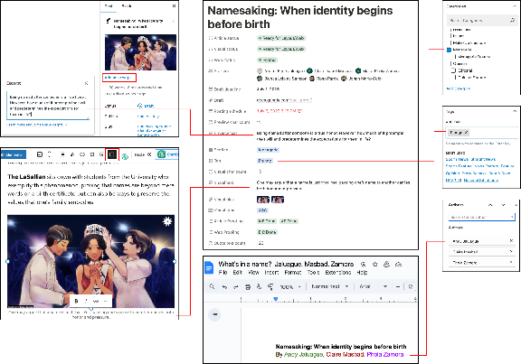  
     
7. **Format the content and double-check for stylebook adherence.** Use H2 for subheadings, remove external hyperlinks, boldface “**The LaSallian**” mentions, and italicize Filipino words. **Important:** Thoroughly review sections [3.1.2](.#312-general-formatting-rules-and-reminders) for general rules and [3.1.3](.#313-article-type-specific-formatting-rules-and-style) to [3.1.4](.#314-headnotes-and-endnotes) for specific article types. Cross-check the content with the TLS Points of Style as well.  
     
8. **Save or publish the article.** Click **Save Draft** to review later or **Publish** to make the article live. Use the **Preview** button to check for any errors before publishing.  
   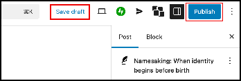

### 3.1.2. General Formatting Rules and Reminders

This is a general list of formatting rules for all article types unless specified otherwise in section [3.1.3](.#313-article-type-specific-formatting-rules-and-style), which includes special instructions for specific articles like print issue articles, Rant and Rave, etc. You can also use this as a final checklist before publishing.

1. **Subheadings**. Use the H2 block for all subheadings. Use sentence case, not title case.   
     
2. **Filipino words.** Italicize all Filipino words in the article title and body. When a word is in square brackets, italicize only the word itself, not the brackets. Follow the instructions below to italicize Filipino words in the title.

   **Italicizing Words in the Article Title**

1. Access the WordPress admin dashboard ([thelasallian.com/wp-admin](http://thelasallian.com/wp-admin)). 

2. On the left sidebar, navigate to **Posts > All Posts.**

3. Locate the article and hover over its row. Click **Quick Edit.**

   **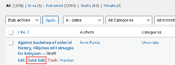**

4. Edit the title. Wrap the Filipino word(s) in between the HTML italic tags <i> and </i>.

   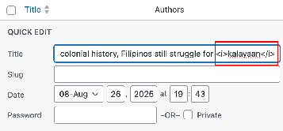

5. Click **Update** to save the changes. Afterward, click **Preview** to verify.

3. **Hyperlinks.** Retain hyperlinks pointing to other TLS articles or social media posts only. Remove all external links, as they are used only for reference during the drafting process.  
     
4. **Mentions of The LaSallian.** Boldface the publication's name, **The LaSallian**, when mentioned in the article body.  
      
5. **Image file size and reuse.** Keep all images under 1 MB to conserve server storage and improve page load times. Compress images, convert PNG to JPG, or resize dimensions as needed. Avoid reuploading an image if it already exists in the Media Library (e.g., author portraits for Opinion articles).  
     
6. **Featured image.** This is the article's primary thumbnail. Use the non-watermarked version of the image.  
     
7. **Inline image.** This is an image placed within the article's body. Use the watermarked version and center-align. Place it either before the first subheading or near the most relevant paragraph (except for Opinion articles; see section [3.1.3](.#313-article-type-specific-formatting-rules-and-style)). 

   Some articles may have multiple inline images. Place them near paragraphs most closely related to the images or as instructed by your editors (Example: [Gowns, gold, and glory: The splendor of Santacruzan processions](https://thelasallian.com/2024/05/31/gowns-gold-and-glory-the-splendor-of-santacruzan-processions/)). 

   

8. **Authors.** List authors alphabetically by surname.List authors in the order they appear in the Google Doc. If an author is missing from the dropdown menu, they must be added to WordPress (see section [3.2.1](../managing-users-and-authors#321-adding-authors-for-articles)). The author of all editorial articles is **The LaSallian** (see also section [3.1.3](.#313-article-type-specific-formatting-rules-and-style)).  
     
9. **Category**. Assign based on the writing section: **University**, **Menagerie**, **Sports**, or **Vanguard**. Use the **Opinion** category for both opinion and editorial articles.  
     
10. **Tags.** Use the tags indicated on the article’s Notion card and verify them against the [regular tags list](../appendix-3a-list-of-regular-section-tags/). Use the **Opinion** tag for opinion articles and the **Editorial** tag for editorials.  

    Rant and Rave articles require an additional tag (See section: [Rant & Rave Articles](#heading=h.1qwlec3007ox)). 

    There may be new tags created for special issues (for example, #Halalan2022). Meanwhile, some tags are created to query articles for web specials or microsites, even if they don't represent a special issue (e.g., RNR media types or Women’s Month themes).

    

11. **Excerpt.** This is indicated as “preview text” in Notion. Most articles require an excerpt, except for press releases and sports recaps (e.g., UAAP, FilOil, etc.), include excerpts. As of Web 63, recap articles by the University (Straight News) and Menagerie (Writer’s Recap) sections include excerpts as well. 

### 3.1.3. Article Type-Specific Formatting Rules and Style

Some articles have additional formatting and style requirements that may also supersede the general rules in 3.1.2. Follow these precisely.

1. **Opinion articles.** The category and tag are both **Opinion**. Use the author’s standard column visual for both the featured and inline images. Place the inline image at the top of the article, before the first paragraph (example: [Psoriasis speaks before I do](https://thelasallian.com/2025/06/25/psoriasis-speaks-before-i-do/)). 

   Search the Media Library for existing visuals before uploading a new one. The filename is usually the editor’s name.

   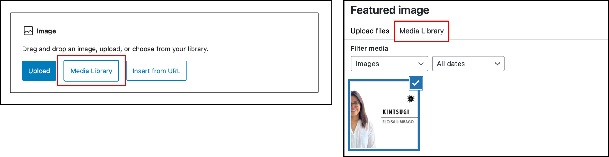

   Some authors held an EB position in a previous year and may have changed their portrait or column name. The opinion visual itself may have also changed. Consult with the Web Editor for such cases to confirm which version to use.

   

   

2. **Editorial articles.** The category is **Opinion**, the tag is **Editorial**, and the author is **The LaSallian**.  
     
3. **Print issue articles.** These articles are also published in the monthly broadsheet. Their inline images must always include a caption, indicated as “visual text” in Notion (except for opinion articles). 

   An endnote, preceded by a separator block indicating the monthly issue, is added at the end of the article (example: [Pursuit of purpose](https://thelasallian.com/2025/02/20/pursuit-of-purpose/)). Make sure the hyperlink is accurate; simply copying and pasting the endnote from another article without updating the link will result in correct URL text but an incorrect hyperlink..

   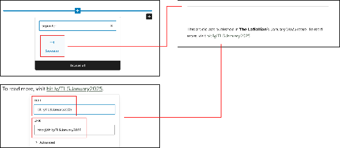

4. **Rant and Rave (RNR) articles.** These Menagerie articles review media such as films. They have special formatting requirements so that their information is completely and correctly fetched by the RNR microsite ([rnr.thelasallian.com](http://rnr.thelasallian.com)).  
* For the article title, spell as **Rant and Rave**, not Rant & Rave.  
* For the tag, use **Rant & Rave**, not Rant and Rave. Additionally, add one more tag for the media type: **Movie**, **Music**, **Television**, or **Miscellaneous**.  
* For the rating at the end of the article, use the exact format **Rating: 2.5/4.0** (**Rating**, not RATING; **4.0**, not 4). Format this as **H5**.

  For multi-item reviews (examples: [Taft cuisine](https://thelasallian.com/2023/01/29/rant-and-rave-a-taste-of-taft-cuisine-part-one/) and [Miss Universe gowns](https://thelasallian.com/2023/12/19/rant-and-rave-glimmer-through-the-gaps-of-the-miss-universe-2023-top-10-evening-gowns/)), add a hidden H5 block so the microsite displays the rating as **Variety**. Follow the instructions below.

  **Adding a Hidden H5 Block for Multi-Item Reviews**

1. At the beginning of the article, insert a **Custom HTML block**

   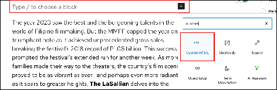

2. Copy paste this exactly: <h5 style="display: none;">Variety</h5>

   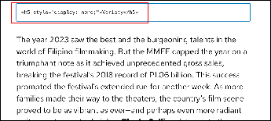

3. Save and/or publish the article. Verify that the block you inserted is invisible.

5. **Head to Head articles**. These are transcript-style University articles published during USG elections. Place the inline image before the first question. Boldface "**The LaSallian**" and candidate surnames that precede the question or answer, including the colons that follow them. Example: [Head to Head: OVPEA aspirants Brenn Takata, Huey Marudo vow to bring career opportunities, amplify student voices](https://thelasallian.com/2025/07/21/head-to-head-ovpea-aspirants-brenn-takata-huey-marudo-vow-to-bring-career-opportunities-amplify-student-voices/). Use the Head to Head tag even if it is a Head On (lone candidate) article.  
     
6. **10 Questions articles**. These are also transcript-style University articles. Place the inline image before the first question. Boldface all questions. Example: [Atty. Leila de Lima bares struggles in seven-year detention, plans post-Crame](https://thelasallian.com/2024/03/26/atty-leila-de-lima-bares-struggles-in-seven-year-detention-plans-post-crame/)  
     
7. **Spoof articles.** Spoof content written by the writing sections is published at [spoof.thelasallian.com](http://spoof.thelasallian.com). The real names of the sections, tags, and authors are not used; follow the Spoof version of these names indicated on Notion. 

   An exception is a serious editorial piece uploaded at [thelasallian.com](http://thelasallian.com). As of TLS63, only one article per section will be posted on social media (with an editor’s note, indicating it is a satire article), while the rest will appear solely on the Spoof website. This, however, can be changed upon the discretion of the current EIC. 

   All Opinion articles discussing serious topics will be posted on social media.

   

8. **Press releases.** The category is **Advertisements**, the tag is **Press Release**, and the author is **External Partners.** Copy and paste the content exactly as it is, without modifications. Place the inline image at the beginning of the article. No excerpt. Always add **PRESS RELEASE:** before the actual article title.  
     
9. **From the Archives articles from pre-website print issues.** When an article that was previously not available on the website—often from past print issues—is uploaded, it should be categorized under its original section (please note that **Features** is now **Menagerie**). Additionally, tag the article as **From the Archives**. Retain the content and capitalization as-is to reflect the writing style and stylebook of the publication at that time. 

### 3.1.4. Headnotes and Endnotes

Headnotes and endnotes are used to add corrections, clarifications, or other contextual notes to an article. Headnotes appear at the beginning of an article, while endnotes appear at the end. Refer to the list below for the formatting used for each type.

1. **General endnotes.** Most endnotes (e.g., for pseudonyms, content edited for brevity, supplementary reports) are italicized. The only exceptions are editor’s notes and errata. However, do not italicize mentions of “ **The LaSallian**.”  
   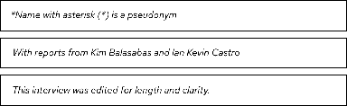  
     
2. **Developing story.** This is a temporary, italicized notice that reads, "This is a developing story. [Explanation, if any]." Remove it once the story is finalized.  
   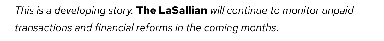

3. **Erratum.** This endnote indicates a factual correction made after publication. Use the format "**ERRATUM: [Date]**" followed by a line break (Shift + Enter) and the explanation.  
   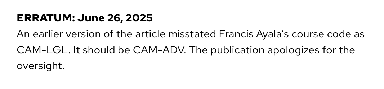  
     
4. **Editor’s note.** This endnote provides clarity or context. For post-publication edits, include the date. For pre-publication notes, omit the date. The format is "**EDITOR’S NOTE: [Date, if applicable]**" followed by a line break and the explanation. An exception is content or trigger warnings.  
   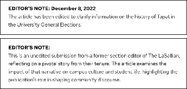

5. **Content or trigger warning.** This headnote warns readers about potentially disturbing content. It takes the format of an editor's note but is placed at the beginning of the article and has no line break. If this is not present in the article but you believe it should be, consult your Web Editor.  
   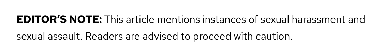

6. **Sports scores.** This endnote provides the final scores for sports coverage articles. It is preceded by the heading "The Scores." Boldface each team's name and total score, the phrase "Quarter Scores" or "Set Scores," and the final quarter/set score.  
   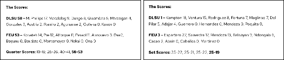  
     
7. **Print issue link.** This endnote indicates that an article was published as part of a monthly broadsheet. See **Print issue articles** in [3.1.3](.#313-article-type-specific-formatting-rules-and-style).  
   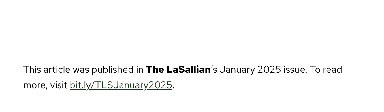
