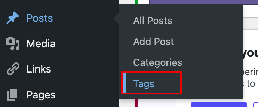
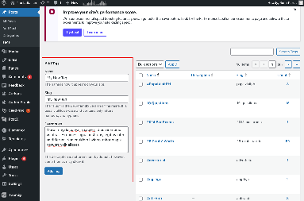

Tags are keywords that group related articles. As of Web 61, we follow a one-category and one-tag system for most articles, but some articles belonging to special issues or microsites may have more than one tag. 

### 3.3.1. When New Tags Are Created

When tagging articles, you will often use existing tags. However, creating new tags is a rare task that serves specific purposes, such as:

* **Special issues.** When the publication features a series of articles for a broadsheet, magazine special, or any collection centered around a unique theme, new tags may be created.  
* **Web specials and microsites.** New tags are used to enable a web special to automatically display articles associated with a specific tag (e.g., all articles tagged #Halalan2025 are shown on [halalan2022.thelasallian.com](http://halalan2022.thelasallian.com)). If the web special is the digital counterpart of a special issue, this tag is the same.  
* **Subcategories within web specials and microsites.** For example, all articles in the Rant and Rave section receive the Rant & Rave tag, along with a secondary tag like Movie or Music, allowing rnr.thelasallian.com to filter them effectively.  
* **New regular section tag.** Occasionally, a writing section may introduce a new tag to its [collection of standard tags](../appendix-3a-list-of-regular-section-tags/).

### 3.3.2. How to Create a New Tag

1. **Navigate to the Tags page.** On the left sidebar of the WordPress dashboard, go to **Posts > Tags**.  
   

2. **Fill in the tag details.** On the left side of the screen, enter the details on the **Add New Tag** form:  
* **Name.** Enter the new tag’s name in title case.  
* **Slug.** This is the URL-friendly version of the name. Ideally, convert the name to lowercase and replace spaces with hyphens.  
* **Description.** Optional and generally left blank. However, it is encouraged to add a description for identification purposes and maintenance by future Web batches.

  

3. **Add the new tag.** Click the **Add New Tag** button. Once complete, the new tag will appear in the list on the right and will be available to add to articles from the post editor.
