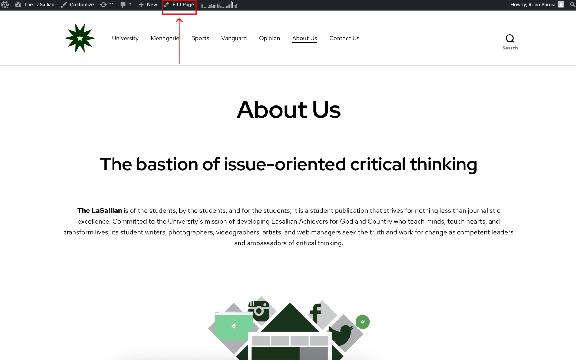

The “About Us” page ([thelasallian.com/about-us](http://thelasallian.com/about-us)) is the digital version of the staffer box found in the broadsheet. It introduces readers to **The LaSallian** and its current organizational structure. Specifically, the page contains the following sections:

* A brief description of **The LaSallian**  
* The current editorial board (EB)  
* The list of staffers per section  
* The list of editors at large  
* The list of Student Media Office (SMO) administrators  
* The list of faculty advisers and consultants

The Web Editor or Assistant Web Editors are responsible for updating the “About Us” page to ensure it reflects the current roster of the publication. It is typically updated during the following instances:

1. **New editorial board**. At the beginning of a new publication year  
     
2. **Editorial board changes.** When a new editor or officer in charge is appointed.  
     
3. **Student Media Office changes**. When there is a new director, new coordinators, or new office assistants.  
     
4. **Newly regularized staffers.** Added to their respective sections in the staffer box. Staffers are always listed in the order of their entry to TLS, except for assistant editors and assistant managers, who take precedence. Newbies and probationary staffers are not listed.  
     
5. **New assistant editors and managers.** Assistant editors are listed first before assistant managers. Both take precedence before the list of regularized staffers. For assistant editors, “(Asst. Ed.)” is appended to their byline. Meanwhile, for assistant managers, “(Asst. <acronym>” is appended. Assistant managers are still listed in the section that they belong to. Refer to the list below for the acronyms:  
* Assistant internal development manager: (Asst. IDM)  
* Assistant externals & training manager: (Asst. ETM)  
* Assistant circulations manager: (Asst. CM)  
* Assistant office manager: (Asst. OM)

6. **Retired editorial board members.** When EB members complete their tenure, they are moved to the “Editors at Large” section. They are listed according to their EB year (oldest first) and position as listed in the “Editorial” board section, in this order:  
* Editor in chief, associate editor, and managing editor  
* University, Menagerie, Sports, and Vanguard editors  
* Intermedia, Photo, Arts & Graphics, Layout, and Web editors  
* Internal development, externals & training, circulations, and office managers

7. **Graduation.** All staffers and Editors-at-Large are removed from the page upon graduating.

The page can be edited by clicking on the **Edit Page** link at the top toolbar when visiting [thelasallian.com/about-us](http://thelasallian.com/about-us). You need to be logged in to see this.

