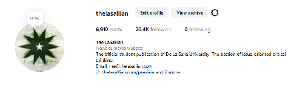
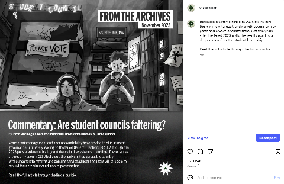
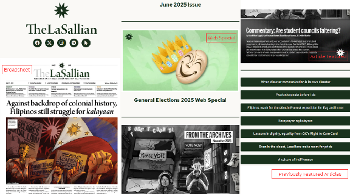
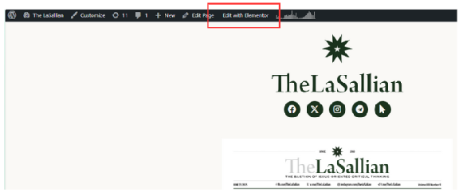
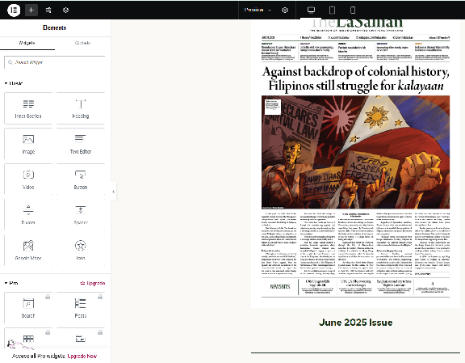
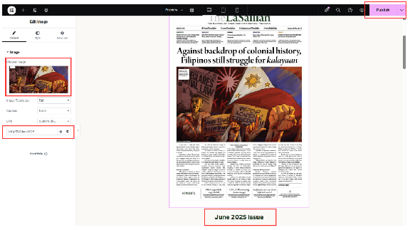
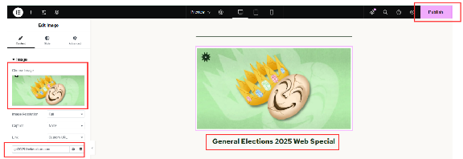
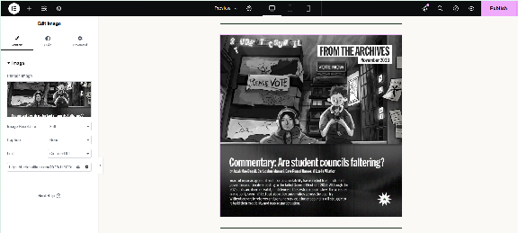
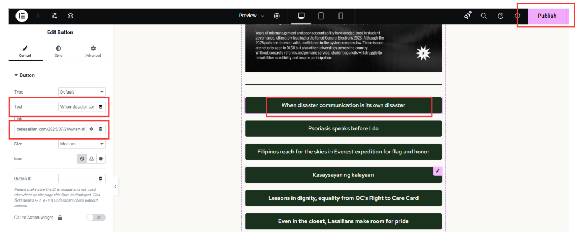

The “Preview” page ([thelasallian.com/preview](http://thelasallian.com/preview)) is the link found on our Instagram bio. It contains a preview of articles posted on Instagram since Instagram captions do not redirect to the link embedded, hence we insert the sentence “Read the full article through the link in our bio.” in Instagram posts with accompanying articles. The Web Editor and the AEs are mainly responsible for changing the preview page’s content, but can this can be delegated to staffers if the need arises. Articles posted on Instagram can be Print, Opinion, and From the Archives articles.

  

1. Clicking the [preview link](http://thelasallian.com/preview) will lead you to a list of clickable articles that redirect to the website.  
   

2. In order to edit the content, you must first be logged in to your WordPress account, then select the Edit with Elementor.  
   

3. You’ll be redirected to this interface.  
   

1. **Broadsheet or special Issues.** When releasing broadsheets or special issues, we replace this portion with the latest one. First, click the broadsheet, then on the left, replace the image with the first page of the broadsheet (must be less than 1MB), which will be given to you by Layout. Second, replace the link. Next, replace the text located below the broadsheet with the correct title. Lastly, click the “Publish” button to save your changes.  
* Format for the broadsheet: [Month] [Year] Issue  
* Format for special issues: [Section/Title] [Year] Special Issue   
  

2. **Web specials.** When releasing Web Specials, we replace this portion with the latest one. First, click the broadsheet, then on the left, replace the image with a preview of the Web Special (must be less than 1MB), which can either be a screenshot of the homepage or an element contained in the Web Special together with a special background. Second, replace the link. Next, replace the text located below the Web Special with the correct title. Lastly, click the “Publish” button to save your changes.  
* Format for Web Special: [Section/Title/Event] [Year] Web Special  
  

3. **Article featured.** The article featured is the latest release; it can also be two or three, depending on how many print articles are released on that day. Similar steps to 3.4.1., except the need to place a text below the image of the article.  
   

4. **Previously featured articles.** When the article is no longer featured, as new articles are already in the 3.4.3. Section, we move those previous articles here. First, duplicate the box. Second, click the box and  then on the left, replace the text portion with the article title. Next, replace the link with the link to the article. Lastly, click the “Publish” button to save your changes.

   There is no limit to the number of boxes here; however, it is recommended to remove old articles that belong in the previous issue.

   
