### 3.2.1. Adding Authors for Articles

Before an author can be assigned to an article, they must have both a user account and an author profile in WordPress. This two-part process involves creating the user first, then linking it to a public author profile. These accounts are for attribution purposes only; authors will not use them to log in.

**A. Create a New User Account**

1. **Navigate to the “Add New User” page.** On the left sidebar, go to Users > Add New.  
   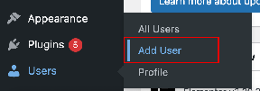  
     
2. **Fill out the new user’s details.** Follow this specific format:  
* **Username**. Use the author’s DLSU email prefix, replacing any underscore (_) with a period (.). For example, **robert_prevost** becomes **robert.prevost**  
* **Email.** Enter the author’s full DLSU email address  
* **First name and last name.** Enter the author’s preferred byline. If unsure, ask the Web Editor, the author’s section editor, or the author themself. The combined first and last name will be the public-facing byline on the website  
* **Website.** Leave blank

3. **Keep the randomly generated strong password.**   
     
4. **Disable the user notification email.** Uncheck the box labeled “Send the new user an email about their account.” This prevents sending unnecessary login details for an account they will not use.  
     
5. **Set the user role.** Using the drop-down menu, set the role to “Author”  
   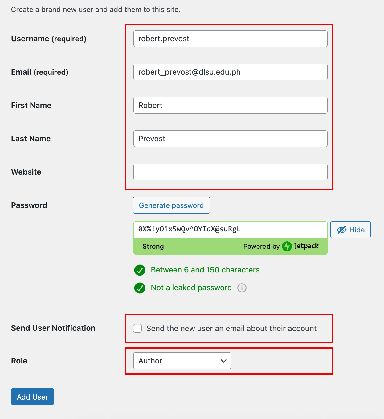  
     
6. **Add the user**. Click the “Add New User” button to complete the account creation.

**B. Create the Author Profile**

1. **Navigate to the “Authors” page**. On the left sidebar, go to Authors > Authors.  
   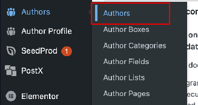

2. **Create a new author profile.** On the “New Author Profile” section on the left portion, ensure “Registered Author With User Account” is selected.

3. **Select the user to map.** On the “Select Author Account” dropdown menu, find and select the user you just created in Part A.

4. **Confirm the display name.** Once selected, the “Display name publicly as” field should automatically show the correct byline. Verify that it is correct.  
   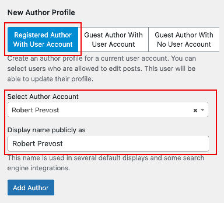

5. **Add the author.** Click the “Add Author” button. The author will now appear in the list on the right and will be available to select when you are uploading or editing an article.

### 3.2.2. Enabling Two-Factor Authentication

All Web staff members have administrator accounts on WordPress. Since Web 62, enabling two-factor authentication has been mandatory. On our WordPress site, two-factor authentication is managed using the [Wordfence Login Security](https://www.wordfence.com/wordfence-login-security/) plugin.

1. **Before you begin:** Install an authenticator app on your mobile device. Google Authenticator is recommended, but any time-based one-time password (TOTP) compatible app will work.  
     
2. **Log in to the WordPress admin dashboard.** Access [thelasallian.com/wp-admin](http://thelasallian.com/wp-admin) with your credentials.  
   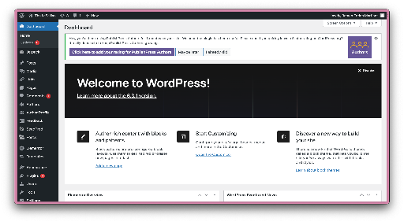  
     
3. **Navigate to your user profile.** On the left sidebar, navigate to Users > Profile  
   **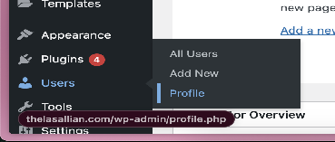**  
     
4. **Begin 2FA activation.** Scroll down to the “Wordfence Login Security” section and click on the “Activate 2FA” button  
   **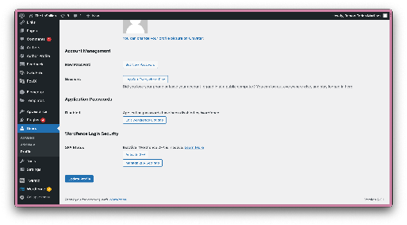**

5. **Download your recovery codes.** The next screen will display a QR code for setup and a list of recovery codes. Click the “Download Recovery Codes” and save the text file in a secure location. These codes are the only way to access your account if you lose access to your authenticator device  
   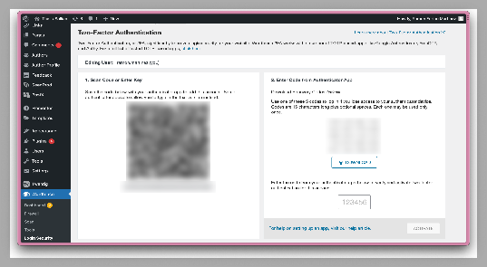  
     
6. **Add a new account to your authenticator app**. Open your authenticator app and select the option to add a new account, often shown as a “+” icon. Choose the option to scan a QR code. This may look slightly different on other applications.  
   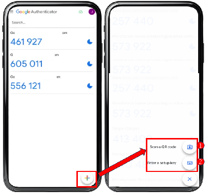

7. **Scan the QR code.** Use your phone’s camera to scan the QR code displayed on the WordPress setup page. Your authenticator app will now generate a six-digit code that refreshes every 30 seconds.  
     
8. **Enter the authentication code and activate.** Type the six-digit code from your app into the text field on the WordPress page and click “Activate.”  
   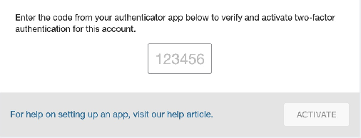

9. **Confirm successful setup.** If you see the screen below, it means 2FA is now active on your WordPress account. The next time you log in, you will be prompted to enter a code from your authenticator app after submitting your password.  
   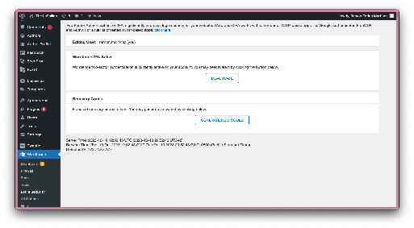
